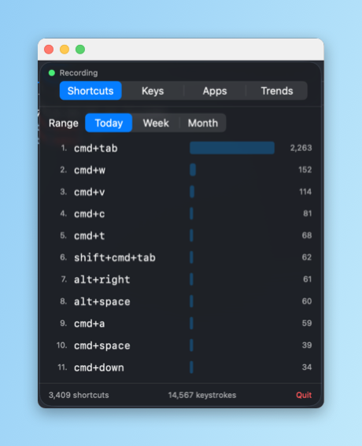
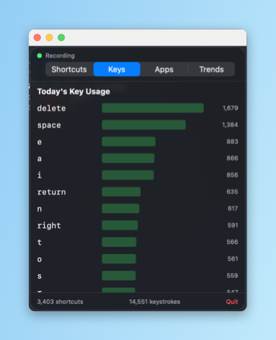
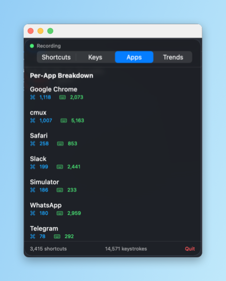

# KeyboardLogger

A lightweight macOS menu bar app that tracks your keyboard shortcut and keystroke usage, broken down by application. Built with SwiftUI and SwiftPM — no Xcode project required.



## Features

- **Menu bar dashboard** — click the icon to see live stats in a compact popover
- **Shortcut tracking** — detects `⌘C`, `⌃A`, and any other modifier combinations
- **Per-app breakdown** — see which apps drive your shortcut usage
- **Key counts & trends** — individual key press counts and usage over time
- **Companion CLI** — `keyboard-logger` for stats, exports (CSV/JSON), and scripting
- **Private by design** — everything is stored locally in SQLite; nothing leaves your machine

## Screenshots

| Shortcuts | Keys | Apps | Trends |
|---|---|---|---|
|  |  |  |  |

## Requirements

- macOS 14 (Sonoma) or later
- Swift 5.10+ (only when building from source)
- **Accessibility / Input Monitoring permission** — required for the event tap

## Install

### From a release (recommended)

1. Download `KeyboardLogger-vX.Y.Z-universal.zip` from the [latest release](https://github.com/oguzhancakmak/keyboard-logger/releases/latest).
2. Unzip and move `KeyboardLoggerApp.app` to `/Applications`.
3. Release builds are **ad-hoc signed**, so Gatekeeper will complain on first launch. Clear the quarantine flag once:
   ```bash
   xattr -dr com.apple.quarantine /Applications/KeyboardLoggerApp.app
   ```
4. Launch the app. When prompted, grant Accessibility access in **System Settings → Privacy & Security → Accessibility**, then click **Grant** in the app's permission banner.

### From source

```bash
git clone https://github.com/oguzhancakmak/keyboard-logger.git
cd keyboard-logger
APP_NAME=KeyboardLogger BUNDLE_ID=com.keyboardlogger.app MENU_BAR_APP=1 \
  ./Scripts/compile_and_run.sh
```

This builds the app, bundles it into `KeyboardLoggerApp.app`, code-signs (ad-hoc), and launches it.

Useful flags:
- `--test` — run unit tests before packaging
- `--release-universal` — build a universal (arm64 + x86_64) release binary

## CLI usage

After building, the CLI lives at `.build/release/keyboard-logger` (or `.build/debug/...`).

```bash
# Today's top shortcuts
keyboard-logger stats

# This week, filtered to a specific app
keyboard-logger stats --range week --app "Xcode"

# Key counts instead of shortcuts
keyboard-logger stats --keys --range month

# List known apps
keyboard-logger apps

# Export everything as JSON
keyboard-logger export --format json --range all > shortcuts.json
```

Subcommands: `stats`, `apps`, `export`, `seed`. Run `keyboard-logger <cmd> --help` for options.

## Development

```bash
# Build + test
swift build
swift test

# Package + launch with a stable dev signing identity (prevents repeated permission prompts)
./Scripts/setup_dev_signing.sh
export APP_IDENTITY='KeyboardLogger Development'
APP_NAME=KeyboardLogger BUNDLE_ID=com.keyboardlogger.app MENU_BAR_APP=1 \
  ./Scripts/compile_and_run.sh --test
```

Data is stored at `~/Library/Application Support/KeyboardLogger/keyboard-logger.sqlite`.

## Privacy

KeyboardLogger only records **which keys and shortcuts were pressed** and **which app was frontmost** — never the surrounding context, typed text, passwords, or content. All data stays on your machine in a local SQLite database. There is no networking code; there are no analytics.

## Contributing

Contributions are welcome! Please read [CONTRIBUTING.md](CONTRIBUTING.md) and our [Code of Conduct](CODE_OF_CONDUCT.md) before opening a PR. Commits follow [Conventional Commits](https://www.conventionalcommits.org/).

## License

[MIT](LICENSE) © 2026 Oguzhan Cakmak
